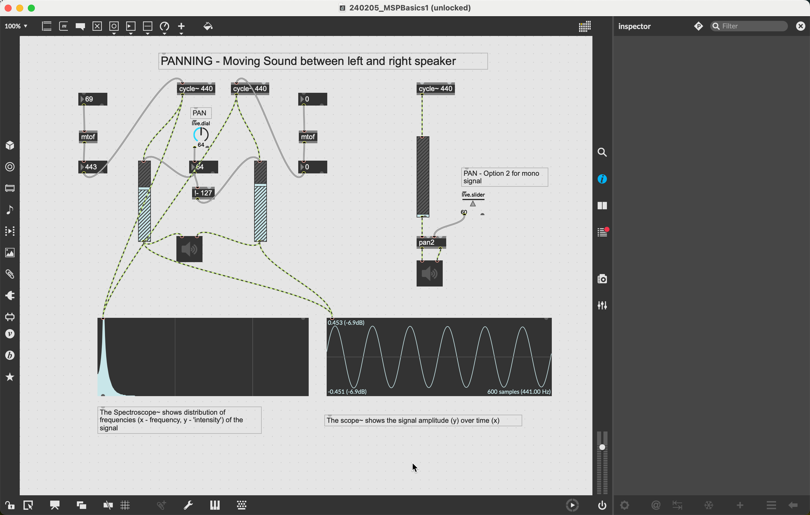
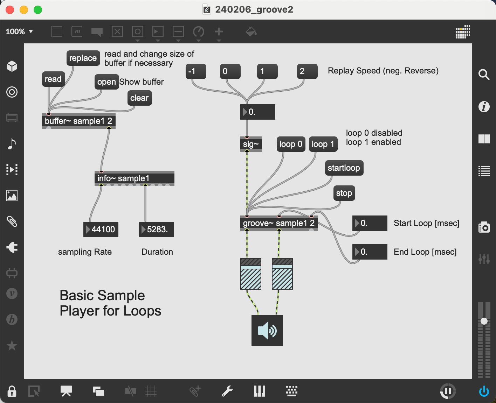
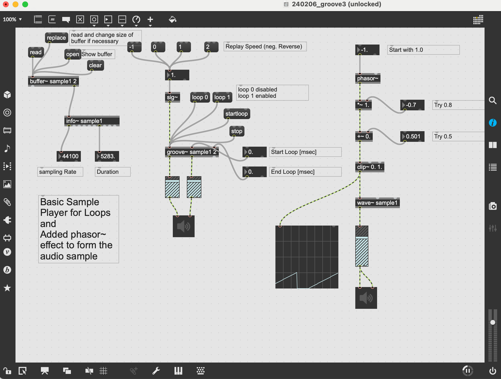

# MAX/MSP

MSP is a set of objects within MAX 8 that allows you to create and manipulate audio/sound directly. While MAX was using a MIDI Syntheziser to make music, MSP allows us
to fully control the process of making audio.

In this repository you find some basic materials, the folder `Patches` contains patches and audio files to work with and remix in MAX 8.

## To get started

### First MSP patch 

I suggest that you just assemble by yourself a small starter patch with the following objects/arguments:

- `cycle~ 440` - The sound source generating a sinus wave
- `gain~` - The volume control
- `ezdac~` - The interface to your computer's loudspeaker

and try to get a sound out of it. You may also add a numberbox and connect its outlet with the inlet of the cycle~ object.

### Two oscillators and panning

Next, load the patch below, it allows you to learn more about  audio and sound within MAX.

### Looping sound samples

The following patch loads a .WAV audio file into the buffer~ object, the groove~ object than allows to loop(repeat) the whole file, or a part of it defined by *Start Loop* and *End Loop*. You need to drag and drop the audio file on the buffer~ object when launching the patch for the first time. Afterwards, click on the `replace` messagebox and then search the file in the appearing Finder/File Explorer window. 

### Extra

## Next steps

Please have a look at the website [Learning Synths](https://learningsynths.ableton.com/en/get-started), it is an easy way to learn and try out the basics of
synthezising sound. Afterwards, you can try to reproduce the effects introduced there directly with MAX/MSP.
